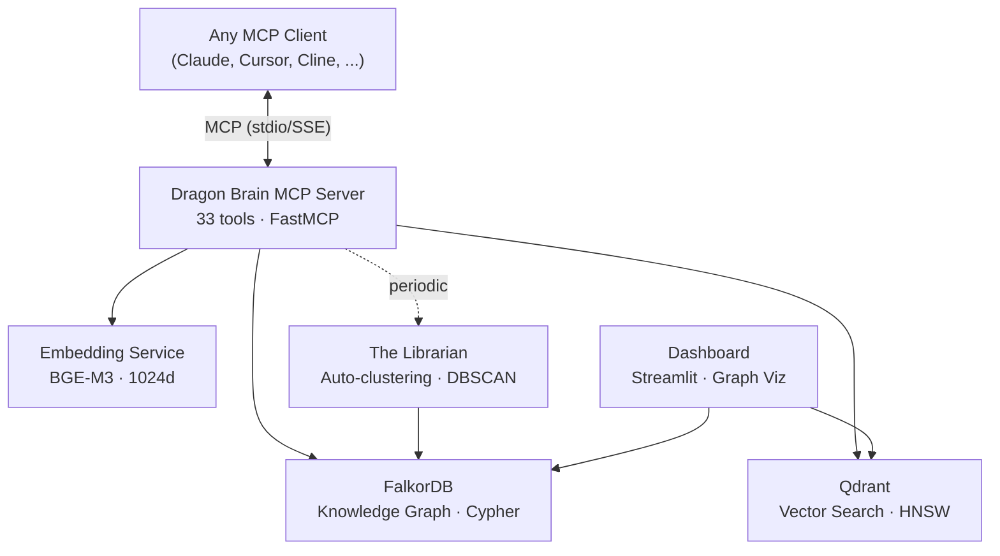
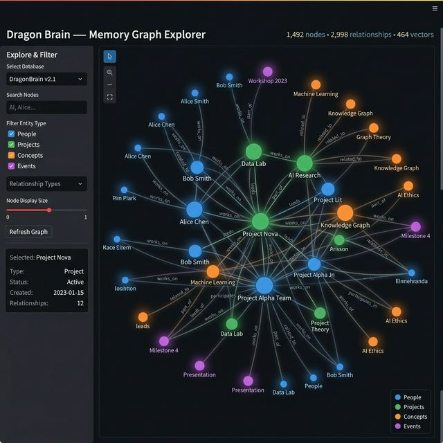

# Dragon Brain

[English](README.md) | [中文](README.zh-CN.md) | [日本語](README.ja.md) | [Español](README.es.md) | [Русский](README.ru.md) | [한국어](README.ko.md) | [Português](README.pt-BR.md) | [Deutsch](README.de.md) | [Français](README.fr.md)

**Persistent memory infrastructure for AI agents.**

[](LICENSE)
[](https://www.python.org/downloads/)
[](docker-compose.yml)
[]()
[]()
[-blue)]()
[]()
[](https://github.com/iikarus/Dragon-Brain/stargazers)

> **1,599 memories** · **33 MCP tools** · **Graph + Vector hybrid retrieval** · **sub-200ms search** · **1,165 tests**

An open-source MCP server that gives any LLM long-term memory using a knowledge graph + vector search hybrid. Store entities, observations, and relationships — then recall them semantically across sessions. Works with any MCP client: Claude Code, Claude Desktop, Cursor, Windsurf, Cline, Gemini CLI.

Unlike flat chat history or simple RAG, Dragon Brain understands *relationships* between memories — not just similarity. An autonomous agent ("The Librarian") periodically clusters and synthesizes memories into higher-order concepts.

## Quick Start

> **Prerequisites:** [Docker](https://docs.docker.com/get-docker/) and [Docker Compose](https://docs.docker.com/compose/install/).
> **Detailed setup:** See [docs/SETUP.md](docs/SETUP.md) for platform-specific notes and troubleshooting.

### 1. Start the Services

```bash
docker compose up -d
```

This spins up 4 containers:
- **FalkorDB** (knowledge graph) — port 6379
- **Qdrant** (vector search) — port 6333
- **Embedding API** (BGE-M3, CPU default) — port 8001
- **Dashboard** (Streamlit) — port 8501

> **GPU users:** `docker compose --profile gpu up -d` for NVIDIA CUDA acceleration.

Verify everything is healthy:
```bash
docker ps --filter "name=claude-memory"
```

<details>
<summary><b>Alternative: Install via pip</b></summary>

```bash
pip install dragon-brain
```

> **Note:** Dragon Brain requires FalkorDB and Qdrant running as Docker services.
> The pip package installs the MCP server — run `docker compose up -d` first for the infrastructure.
> The embedding model (~1GB) is served via Docker, not downloaded locally.

</details>

### 2. Connect Your AI Agent

**Claude Code (recommended):**
```bash
claude mcp add dragon-brain -- python -m claude_memory.server
```

<details>
<summary><b>Claude Desktop / Other MCP Clients</b></summary>

Add to your MCP client config:

```json
{
  "mcpServers": {
    "dragon-brain": {
      "command": "python",
      "args": ["-m", "claude_memory.server"],
      "env": {
        "FALKORDB_HOST": "localhost",
        "FALKORDB_PORT": "6379",
        "QDRANT_HOST": "localhost",
        "QDRANT_PORT": "6333",
        "EMBEDDING_API_URL": "http://localhost:8001"
      }
    }
  }
}
```

See `mcp_config.example.json` for a full template.

</details>

### 3. Start Remembering

```
You: "Remember that I'm building Atlas in Rust and I prefer functional patterns."
AI:  [creates entity "Atlas", adds observations about Rust and functional patterns]

You (next session): "What do you know about my projects?"
AI:  "You're building Atlas in Rust with a functional approach..." [recalled from graph]
```

## How It Compares

| Feature | Chat History | Simple RAG | Dragon Brain |
|---------|:-----------:|:----------:|:------------:|
| Persists across sessions | No | Depends | **Yes** |
| Understands relationships | No | No | **Yes (graph)** |
| Semantic search | No | Yes | **Yes (hybrid)** |
| Time travel queries | No | No | **Yes** |
| Auto-clustering | No | No | **Yes (Librarian)** |
| Relationship discovery | No | No | **Yes (Semantic Radar)** |
| Works with any MCP client | N/A | Varies | **Yes** |

## Capabilities

| Capability | How It Works |
|------------|-------------|
| **Store memories** | Creates entities (people, projects, concepts) with typed observations |
| **Semantic search** | Finds memories by meaning, not just keywords — "that thing about distributed systems" works |
| **Graph traversal** | Follows relationships between memories — "what's connected to Project X?" |
| **Time travel** | Queries your memory graph at any point in time — "what did I know last Tuesday?" |
| **Auto-clustering** | Background agent discovers patterns and creates concept summaries |
| **Relationship discovery** | Semantic Radar finds missing connections by comparing vector similarity against graph distance |
| **Session tracking** | Remembers conversation context and breakthroughs |

## Architecture



<!-- GitHub renders Mermaid natively. Fallback SVG for other viewers: -->
<!--  -->

- **Graph Layer**: FalkorDB stores entities, relationships, and observations as a Cypher-queryable knowledge graph
- **Vector Layer**: Qdrant stores 1024d embeddings for semantic similarity search
- **Hybrid Search**: Queries hit both layers, merged via Reciprocal Rank Fusion (RRF) with spreading activation enrichment
- **Semantic Radar**: Discovers missing relationships by comparing vector similarity against graph distance
- **The Librarian**: Autonomous agent that clusters memories and synthesizes higher-order concepts



## MCP Tools (Top 10)

| Tool | What It Does |
|------|-------------|
| `create_entity` | Store a new person, project, concept, or any typed node |
| `add_observation` | Attach a fact or note to an existing entity |
| `search_memory` | Semantic + graph hybrid search across all memories |
| `get_hologram` | Get an entity with its full connected context (neighbors, observations, relationships) |
| `create_relationship` | Link two entities with a typed, weighted edge |
| `get_neighbors` | Explore what's directly connected to an entity |
| `point_in_time_query` | Query the graph as it existed at a specific timestamp |
| `record_breakthrough` | Mark a significant learning moment for future reference |
| `semantic_radar` | Discover missing relationships via vector-graph gap analysis |
| `graph_health` | Get stats on your memory graph — node counts, edge density, orphans |

All 33 tools are documented in [docs/MCP_TOOL_REFERENCE.md](docs/MCP_TOOL_REFERENCE.md).

## Why I Built This

Claude is brilliant but forgets everything between conversations. Every new chat starts from scratch — no context, no continuity, no accumulated understanding. I wanted Claude to *remember* me: my projects, preferences, breakthroughs, and the connections between them. Not a flat chat history dump, but a living knowledge graph that grows richer over time.

## Quality

Production-grade testing: **1,165 unit tests** · mutation testing (3-evil/1-sad/1-happy) · property-based testing (38 Hypothesis properties) · fuzz testing (30K+ inputs, 0 crashes) · static analysis (mypy strict, ruff) · security audit · **Gauntlet score: A- (95/100)**.

Full results: [GAUNTLET_RESULTS.md](docs/GAUNTLET_RESULTS.md)

## Use Cases

- **Long-term projects** — Build up context over weeks/months. Dragon Brain remembers architecture decisions, breakthroughs, and the reasoning behind them.
- **Research** — Create a persistent knowledge graph of papers, concepts, and connections. Semantic search finds relevant memories by meaning, not keywords.
- **Multi-agent systems** — Shared memory layer for agent teams. One agent's discoveries are immediately searchable by others.
- **Personal knowledge management** — Your AI learns your preferences, working style, and domain expertise over time.

## Troubleshooting

| Problem | Fix |
|---------|-----|
| MCP tools not showing up | MCP failures are **silent**. Check `docker ps --filter "name=claude-memory"` — all 4 containers should be healthy. |
| `search_memory` returns empty | Verify the embedding service is running on port 8001. Check `curl http://localhost:8001/health`. |
| Graph name confusion | The FalkorDB graph is named `claude_memory` (not `dragon_brain`). Use this name for direct Cypher queries. |

More: [docs/GOTCHAS.md](docs/GOTCHAS.md) · [docs/RUNBOOK.md](docs/RUNBOOK.md)

## Documentation

| Doc | What's In It |
|-----|-------------|
| [User Manual](docs/USER_MANUAL.md) | How to use each tool with examples |
| [MCP Tool Reference](docs/MCP_TOOL_REFERENCE.md) | API reference: all 33 tools, params, return shapes |
| [Architecture](docs/ARCHITECTURE.md) | System design, data model, component diagram |
| [Maintenance Manual](docs/MAINTENANCE_MANUAL.md) | Backups, monitoring, troubleshooting |
| [Runbook](docs/RUNBOOK.md) | 10 incident response recipes |
| [Code Inventory](docs/CODE_INVENTORY.md) | File-by-file manifest |
| [Gotchas](docs/GOTCHAS.md) | Known traps and edge cases |

## Local Development

Requires **Python 3.12+**.

```bash
# Install
pip install -e ".[dev]"

# Run tests
tox -e pulse

# Run server locally
python -m claude_memory.server

# Run dashboard
streamlit run src/dashboard/app.py
```

### Claude Code CLI

```bash
claude mcp add dragon-brain -- python -m claude_memory.server
```

For environment variables, create a `.env` file or export them:

```bash
export FALKORDB_HOST=localhost
export FALKORDB_PORT=6379
export QDRANT_HOST=localhost
export EMBEDDING_API_URL=http://localhost:8001
```

## Contributing

See [CONTRIBUTING.md](CONTRIBUTING.md) for testing policy, code style, and how to submit changes.

## License

[MIT](LICENSE)
